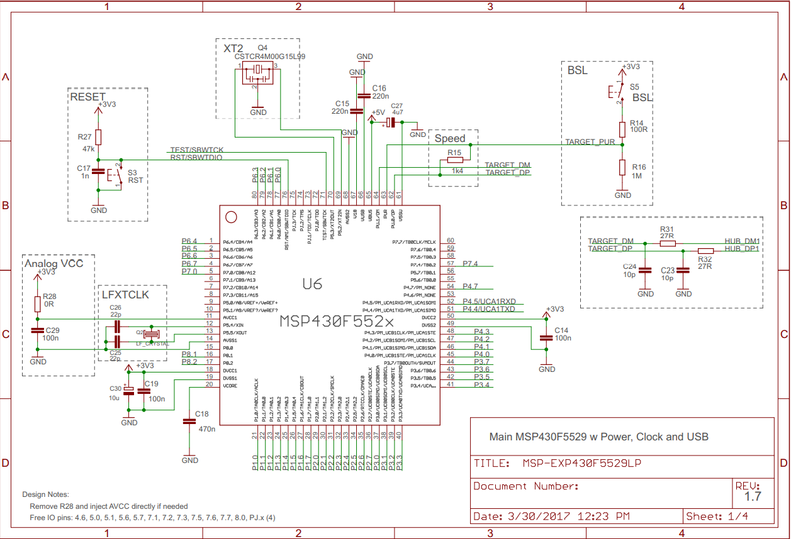
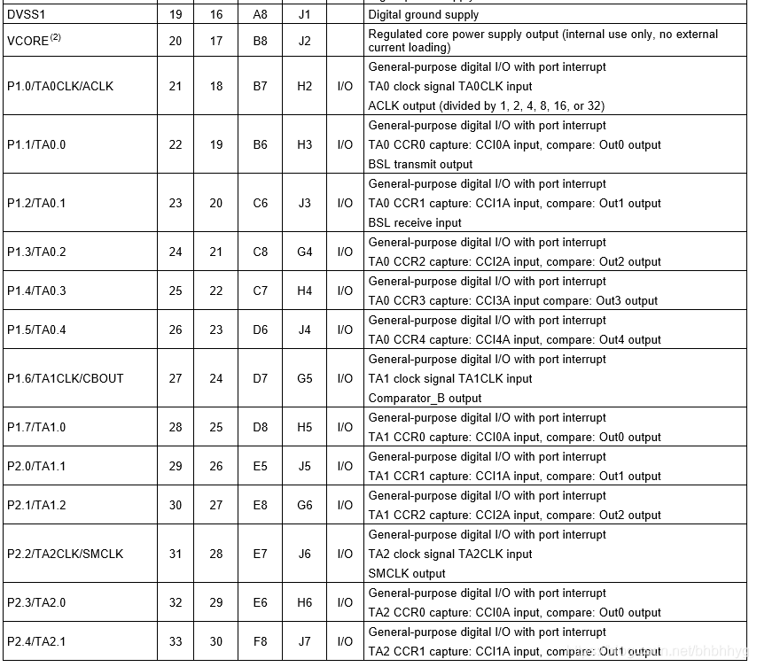

电赛可能会限制使用TI公司的芯片  
因此为了不让自己丢掉以前的知识  
最好做个笔记，免得忘了就难受。
<!-- note -->

# MSP430输出PWM波-寄存器

## 开发环境
CCS v10.4.0 (Code Composer Studio 10.4.0)  
软件是免费的，随便百度一下就有了

## 硬件
MSP-EXP430F5529LP 即 MSP430F5529 特点  

以上!
[手册pdf](https://www.ti.com.cn/cn/lit/ds/symlink/msp430f5529.pdf?ts=1657006504445&ref_url=https%253A%252F%252Fwww.ti.com.cn%252Fproduct%252Fzh-cn%252FMSP430F5529%253FkeyMatch%253DMSP430F5529%2526tisearch%253Dsearch-everything%2526usecase%253DGPN)  
板子是这个  

原理图如下  
  
板载仿真器  


## 能输出PWM波的引脚
看了用户手册，发现这些引脚是可以使用CCR输出PWM波的  
  
我试了一 遍，除了被用做灯和按键的P10、P11、P21外都能的  
如果不能，可能芯片引脚有点问题，或者外接了其他东西  

## 代码部分
寄存器配置的，所以看着代码来懂  
```c++
#include <msp430.h>

#define  P12   TA0CCR1              //该引脚置一，右边电机正转
#define  P14   TA0CCR3              //该引脚置一，左边电机正转
#define  P13   TA0CCR2              //该引脚置一，左边电机反转
#define  P15   TA0CCR4              //该引脚置一，右边电机反转

void PWM_Init(void)
{
     P1DIR |= BIT3+BIT2+BIT5+BIT4;  //配置P1.2,3,4,5口的为输出口
     P1SEL |= BIT3+BIT2+BIT5+BIT4;  //开启1.2，3，4，5口的io复用，因为要用来输出pwm

     unsigned const PWM_T=2000;     //设置PWM周期参数
     TA0CCR0 =PWM_T;                //设置PWM周期

     TA0CTL= TASSEL_2 + MC_1;       // 选择SMCKL + 选择比较模式
     TA0CCTL1 = OUTMOD_7;           //设置TA0CCR1的PWM的输出模式为7模式 --reset/set模式
     TA0CCTL2 = OUTMOD_7;
     TA0CCTL3 = OUTMOD_7;
     TA0CCTL4 = OUTMOD_7;
}

void main(void)
{
    //关闭看门狗，必须要这一步
    WDTCTL = WDTPW | WDTHOLD;
    PWM_Init();

    /*差速转弯*/
    P12=1000;                       //右边电机得到占空比为1000/2000
    P15=500;                        //左边电机得到的占空比为500/2000
    P13=1000;
    P14=500;
}
```
需要注意的是引脚要对应上CCR编号，比如P12对应CCR1，上图都有
