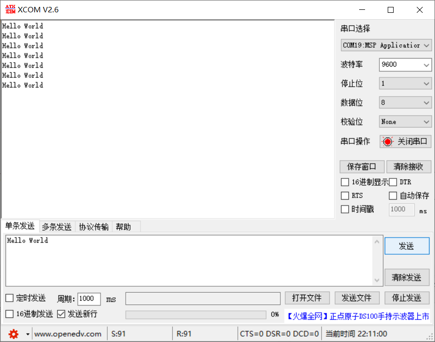

电赛可能会限制使用TI公司的芯片  
因此为了不让自己丢掉以前的知识  
最好做个笔记，免得忘了就难受。
<!-- note -->

# MSP430F5529串口通信-寄存器

## 开发环境
CCS v10.4.0 (Code Composer Studio 10.4.0)  
软件是免费的，随便百度一下就有了

## 硬件
MSP-EXP430F5529LP 即 MSP430F5529 特点  

以上!
[手册pdf](https://www.ti.com.cn/cn/lit/ds/symlink/msp430f5529.pdf?ts=1657006504445&ref_url=https%253A%252F%252Fwww.ti.com.cn%252Fproduct%252Fzh-cn%252FMSP430F5529%253FkeyMatch%253DMSP430F5529%2526tisearch%253Dsearch-everything%2526usecase%253DGPN)  
板子是这个  

原理图如下  
  
板载仿真器  


## 串口通信
先看原理图
  
  
UCA0与UCA1就是串口了  
由于板载仿真器与MSP430相连串口1即UCA1  
那就拿串口一实验吧  

### 初始化
从原理图可知UCA1通信IO口为P4.4 TX / P4.5 RX  
所以我们选择P44与P45  
深层的原理就不讲了，毕竟配置的寄存器  
寄存器一些参数网上也都有看着代码来理解吧  
```c++
void UCA1_Init(void)
{
    P4SEL |= BIT4+BIT5;                 // 选择引脚 P4.4TX & P4.5RX
    UCA1CTL1 |= UCSWRST;                // 软件复位-置1: 0禁止(USCI复位释放)/ 1使能(复位状态保持)
    UCA1CTL1 |= UCSSEL_2;               // 时钟选择-SMCLK:: 0UCLK | 1ACLK | 2MCLK  SMCLK默认1MHz
    UCA1BR0 = 0x06;                     // 波特率寄存器0 (存整数的低八位)   计算: (1M/9600)/16 = 6.51 => 6
    UCA1BR1 = 0x00;                     // 波特率寄存器1 (存整数的高八位)
    UCA1MCTL |= UCBRS_0 + UCBRF_13;     // 设置波特率。如果 SMCLK 速度或波特率分别配置为 8 MHz 和 28.8 kbps 以外的任何值，则必须进行调整。有关说明，请参阅 bcUart.h
    UCA1MCTL |= UCOS16;                 // 0|1 \ 低频|高频模式
    UCA1CTL1 &= ~UCSWRST;               // 软件复位-清0: 0禁止(USCI复位释放)/ 1使能(复位状态保持)
    UCA1IE |= UCRXIE;                   // UCA1使能: RX使能|   UCTXIE: TX使能  UCSTTIE: 启动条件中断使能  UCSTPIE: 停止条件中断使能
    _EINT();                            // 使能总中断 => 等价_enable_interrupt()
}
```
串口初始化跟51单片机差不多，可以按照51寄存器配置串口思路来配置MSP430的串口  

### 中断处理
串口必然有中断，MSP430的中断跟51有点差别，但思路都是一样的  
```c++
unsigned short RxDataBuf[100];
unsigned short RxDataLen = 0;
unsigned short RxDataFlag = 0;
unsigned short RxChar;
#pragma vector = USCI_A1_VECTOR
__interrupt void USCI_ISR()
{
    switch(_even_in_range(UCA1IV,4))              // 在[0,4]区间内对UCA1IV进行遍历，提高switch的效率
    {
        case 0:break;                             // Vector 0 - No interrupt
        case 2:                                   // Vector 2 - RXIFG
        {
            while (!(UCA0IFG&UCTXIFG));           // 等待TX标志位
            UCA1TXBUF = UCA1RXBUF;                // 发送接收到的数据

            UCA1IFG &= ~UCRXIFG;                  // 清除中断标志
            RxChar = UCA1RXBUF;                   // 缓存接收的数据（接收一次完整的数据）防止接收的数据不完整
            RxDataBuf[RxDataLen] = RxChar;
            RxDataLen++;
            if(RxChar == '\n')
            {
                RxDataFlag = 1;
            }
            break;
        }
        case 4: break;
        default: break;
    }
}
```

### 发送一个字节数据与发送字符串
初始化完成后，我们就能使用了  
```c++
/*发送一个字节数据*/
void sendChar(char c)
{
    UCA1TXBUF = c;
    while(!( UCA1IFG & UCTXIFG ));      //等待发送标志位
}
/*发送一个字符串*/
void sendStr(unsigned char *pstr)
{
    while(*pstr != '\0')
    {
        while(!(UCA1IFG & UCTXIFG));    //等待发送标志位
        UCA1TXBUF = *pstr++;
    }
}
```

## 整合后的代码
最后附上全代码，主要看懂原理，而非完全copy。
```c++
#include <msp430.h>

void sendChar(char c);
void sendStr(unsigned char *sptr);
void UCA1_Init(void);

unsigned short RxDataBuf[100];
unsigned short RxDataLen = 0;
unsigned short RxDataFlag = 0;
unsigned short RxChar;

void main(void)
{
	WDTCTL = WDTPW | WDTHOLD;	        // 关闭看门狗
	UCA1_Init();
	while(1)
	{
	    //sendStr("Hello!\r\n");
	}
}

void UCA1_Init(void)
{
    P4SEL |= BIT4+BIT5;                 // 选择引脚 P4.4TX & P4.5RX
    UCA1CTL1 |= UCSWRST;                // 软件复位-置1: 0禁止(USCI复位释放)/ 1使能(复位状态保持)
    UCA1CTL1 |= UCSSEL_2;               // 时钟选择-SMCLK:: 0UCLK | 1ACLK | 2MCLK  SMCLK默认1MHz
    UCA1BR0 = 0x06;                     // 波特率寄存器0 (存整数的低八位)   计算: (1M/9600)/16 = 6.51 => 6
    UCA1BR1 = 0x00;                     // 波特率寄存器1 (存整数的高八位)
    UCA1MCTL |= UCBRS_0 + UCBRF_13;     // 设置波特率。如果 SMCLK 速度或波特率分别配置为 8 MHz 和 28.8 kbps 以外的任何值，则必须进行调整。有关说明，请参阅 bcUart.h
    UCA1MCTL |= UCOS16;                 // 0|1 \ 低频|高频模式
    UCA1CTL1 &= ~UCSWRST;               // 软件复位-清0: 0禁止(USCI复位释放)/ 1使能(复位状态保持)
    UCA1IE |= UCRXIE;                   // UCA1使能: RX使能|   UCTXIE: TX使能  UCSTTIE: 启动条件中断使能  UCSTPIE: 停止条件中断使能
    _EINT();                            // 使能总中断 => 等价_enable_interrupt()
}

void sendChar(char c)
{
    UCA1TXBUF = c;
    while(!( UCA1IFG & UCTXIFG ));
}

void sendStr(unsigned char *pstr)
{
    while(*pstr != '\0')
    {
        while(!(UCA1IFG & UCTXIFG));
        UCA1TXBUF = *pstr++;
    }
}

// 串口中断服务函数
#pragma vector = USCI_A1_VECTOR
__interrupt void USCI_ISR()
{
    switch(_even_in_range(UCA1IV,4))              // 在[0,4]区间内对UCA1IV进行遍历，提高switch的效率
    {
        case 0:break;                             // Vector 0 - No interrupt
        case 2:                                   // Vector 2 - RXIFG
        {
            while (!(UCA0IFG&UCTXIFG));           // 等待TX标志位
            UCA1TXBUF = UCA1RXBUF;                // 发送接收到的数据

            UCA1IFG &= ~UCRXIFG;                  // 清除中断标志
            RxChar = UCA1RXBUF;                   // 缓存接收的数据（接收一次完整的数据）防止接收的数据不完整
            RxDataBuf[RxDataLen] = RxChar;
            RxDataLen++;
            if(RxChar == '\n')
            {
                RxDataFlag = 1;
            }
            break;
        }
        case 4: break;
        default: break;
    }
}
```

## 运行效果图
串口持续输出Hello！  
  
串口助手发送Hello World，返回Hello World  


## 补充
TI公司那个MSP-EXP430F5529LP板（也就是此教程的板子）串口0不与仿真器直连  
如果需要测试串口0可以使用USB转TTL（CH340芯片）模块将TX与板子RX，RX与板子TX相连  
再去测试串口。

## 疑问
UCA1MCTL |= UCBRS_0 + UCBRF_13;     // 设置波特率。  
这个我也不是很懂是怎么配置的，配置表格我没在用户手册看到  
四处查阅别的大佬才知道这样配置的  
